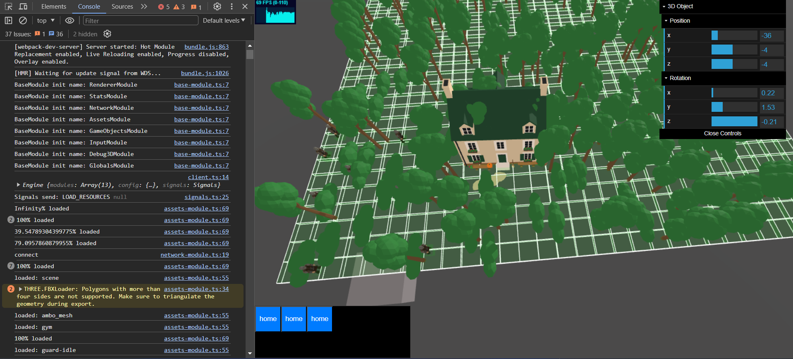

# Three.js RTS Game Engine Demo in TypeScript



Welcome to the Three.js RTS Game Engine Demo! 

This project demonstrates a real-time strategy (RTS) game engine built using TypeScript and the Entity Component System (ECS) approach. It features advanced pathfinding, pseudo-random number generation, and socket-based networking for multiplayer support.

### Key features:

- **Three.js Rendering**: Leverages Three.js for stunning 3D graphics and rendering.
- **TypeScript**: Written in TypeScript for enhanced development experience and type safety.
- **ECS Architecture**: Implements an Entity Component System for flexible and maintainable game logic.
- **Pathfinding**: Utilizes efficient algorithms for smooth and intelligent unit movement.
- **Pseudo-Random Generation**: Provides dynamic and unpredictable game elements.
- **Socket Networking**: Enables real-time multiplayer interactions through socket connections.

This demo serves as an excellent resource for learning and developing RTS games, showcasing practical implementations of advanced game development techniques. Ideal for developers, students, and enthusiasts interested in game development. Contributions and forks are welcome!

## Based on Three.js TypeScript Boilerplate

### `socket.io` Branch

```bash
git clone https://github.com/Sean-Bradley/Three.js-TypeScript-Boilerplate.git
cd Three.js-TypeScript-Boilerplate
git checkout socketio
npm install
npm run dev
```

Visit [http://127.0.0.1:8080](http://127.0.0.1:8080)
